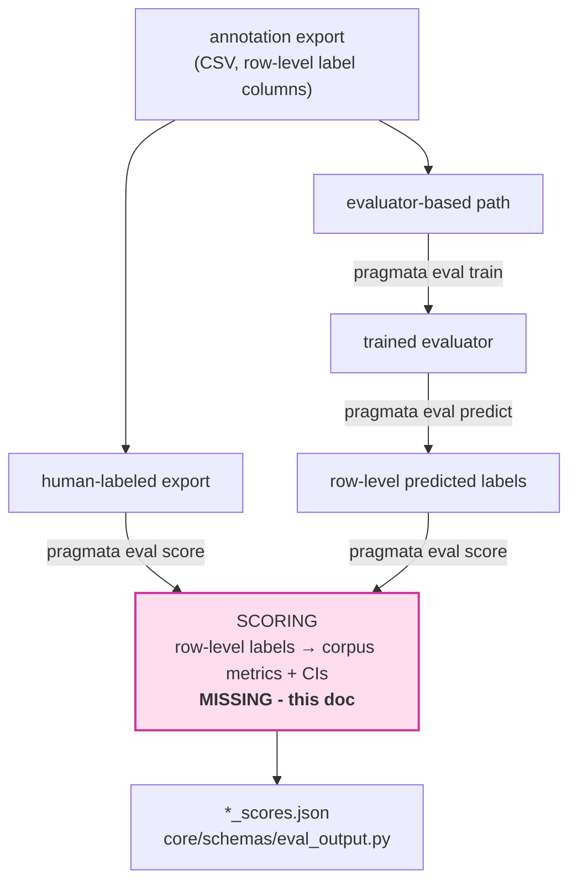
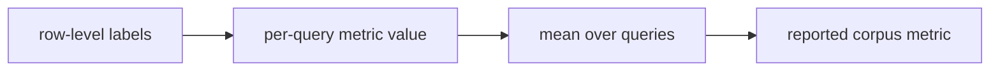

# Eval scoring layer: translate labels into corpus metrics with uncertainty

## Summary

Builds the eval scoring stage:

- turns row-level label columns (either manually annotated or evaluator-predicted) into per-query values and corpus-level metrics defined in the [metrics taxonomy](../methodology/metrics-taxonomy.md). Retrieval is the special case: chunk rows grouped by query.
- attaches a confidence interval to every reported metric. **Scope of these CIs:** they estimate sampling uncertainty over query examples only. They do **not** capture annotator disagreement, evaluator/model label error, or benchmark construction bias. That boundary is part of the contract, not a footnote.
- exposes scoring via the public API (`pragmata.eval.score(...)`) and a `pragmata eval score` CLI subcommand, extending the existing `eval` command group.
- reuses/generalises the existing IAA uncertainty helpers (Wilson + percentile bootstrap).

## Background - current state

Scoring is the missing piece. `train`/`predict` are already in development and are part of the eval workflow, not an external tlmtc-only block. The flow starts at `annotation export` and branches:



Precisely: paths, settings, and report schemas are already in place. What is missing is the scoring computation itself plus the API/CLI wiring around it.

- report shapes exist (`eval_output.py`) but each metric is a bare `Rate = float[0,1]` and nothing computes them.
- the `eval` CLI group exists (`cli/commands/eval.py`, currently `train-evaluator`); a `score` subcommand is missing.
- IAA already reports bootstrap CIs on Krippendorff's alpha - `core/annotation/iaa.py:bootstrap_alpha` (seeded, computes percentiles, configurable `n_resamples`), surfaced through `iaa_report.py` (`ci_lower/ci_upper/ci_level/n_bootstrap_resamples`), driven by `api/annotation_iaa.py:compute_iaa` -> `iaa_runner.py:run_iaa`.

## Goals

- compute all metrics (retrieval 6, grounding 5, generation 5 = 16) from row-level labels.
- attach CIs (sampling uncertainty over queries).
- public API: `pragmata.eval.score(...)`.
- CLI: `pragmata eval score`.
- extract shared uncertainty helpers (Wilson + percentile bootstrap) into `core/annotation/uncertainty.py`, refactor IAA to reuse them, and import them from eval.

## Non-goals

Boundaries that resolve likely implementation ambiguity for this scoring layer:

- **evaluator label noise:** the cross-encoder is imperfect; propagating its classification error is only relevant on the predict-from-model path (human-label scoring has none) and is a materially larger design. Deferred.
- **run-to-run comparison / significance:** we emit per-run CIs only. Comparing two runs rigorously needs a *paired* difference-CI (overlap of two independent CIs is **not** a significance test). Out of scope.
- **bias-corrected-&-accelerated (BCa) intervals:** we chose percentile; BCa is the upgrade only if coverage proves poor.

## Design

### Grain and resampling unit



- **Retrieval:** per-chunk labels -> each retrieval metric computes its own per-query `@K` value from that query's ranked chunks -> corpus metric is the mean over those per-query values.
- **Grounding / generation:** one row per query -> corpus metric is a proportion over queries.

The unit everything averages over is the **query**, and the query is also the resampling unit: resample whole queries with replacement, keeping each query's chunks attached (cluster bootstrap). Resampling chunks would break the `/K` denominator and rank order and understate variance (the hierarchical caveat in ADR-0012).

### Uncertainty method - per metric

| Family | Metrics | Method | n |
|---|---|---|---|
| Proportion (binary per query) | non-conditional grounding (4), all generation (5), `sufficiency_hit_at_k` | **Wilson** closed-form | #queries |
| Conditional proportion | `conditional_fabrication_rate` | **Wilson** on the cited subset | #cited queries |
| Continuous mean over queries | `ndcg_at_k`, `mean_reciprocal_rank_at_k`, `topical_precision_at_k`, `sufficiency_rate_at_k`, `misleading_context_rate_at_k` | **query-level percentile bootstrap** | #queries |

Totals: 11 Wilson (10 unconditional + 1 conditional) + 5 bootstrap = 16 metrics.

`method` is recorded per metric. Wilson is chosen for proportions because it is well-behaved at small n (bootstrapping a proportion degenerates); bootstrap for the continuous metrics because they have no clean closed form.

### Shared uncertainty helpers - `core/annotation/uncertainty.py`

The shared surface today is just uncertainty helpers for IAA/eval reporting. Rather than a broad new top-level `core/stats.py`, the helpers live under a single owning domain (`core/annotation`, where the bootstrap logic already exists in `iaa.py`) and are imported from eval. `iaa.py:bootstrap_alpha` is refactored to reuse `percentile_bootstrap`. If a broader core-level stats surface later emerges, this can be promoted.

```python
def wilson_interval(successes: int, n: int, *, ci: float = 0.95) -> tuple[float, float]:
    """Wilson score interval for a binomial proportion. Returns (lower, upper)."""
```
```python
def percentile_bootstrap(
    n_units: int,
    statistic: Callable[[NDArray[np.intp]], float],
    *, n_resamples: int = 1000, ci: float = 0.95, seed: int | None = None,
) -> tuple[float, float]:
    """Percentile bootstrap CI. Resamples unit indices [0, n_units) with replacement,
    applies `statistic` to each resample, drops NaN replicates (as IAA does)."""
```

### Output contract - `core/schemas/eval_output.py`

Introduce a nested per-metric model so the point estimate, uncertainty method, and effective denominator travel together:

```python
class MetricScore(BaseModel):
    model_config = ConfigDict(frozen=True, extra="forbid")
    point: Rate
    ci_lower: Rate
    ci_upper: Rate
    method: Literal["wilson", "bootstrap"]
    n: PositiveInt            # effective denominator (queries)
```

Each metric field changes from `Rate` -> `MetricScore`.

The report schemas also record the run-level uncertainty settings so the JSON artifacts are self-describing. Added to `RetrievalScoreReport`, `GroundingScoreReport`, and `GenerationScoreReport`:

- `ci_level` - applies to every metric.
- `n_bootstrap_resamples` - applies to metrics with `method == "bootstrap"`.

### Compute and decomposition

No second core-level orchestration layer (no `run_scoring`). The public API is the single orchestration point; core exposes small functions with clear ownership:

- **validation** - in the schema/import layer (`eval_input.py`, `validate_eval_score_frame`).
- **query grouping / preparation** - a focused eval helper under `core/eval`.
- **metric computation** - `core/eval/metrics.py` (new): pure, deterministic per-query metric functions matching the taxonomy formulas, plus corpus aggregation. Kept I/O-free so it is straightforward to test.
- **uncertainty** - `core/annotation/uncertainty.py` (Wilson / percentile bootstrap).
- **report assembly** - in the API command path.

### Public API - `pragmata.eval.score(...)`

Lives in `api/eval.py` alongside `train_evaluator` (no separate `api/eval_score.py`). It is the orchestrator, not a shell around a core `run_scoring`: resolve settings/paths, select the input, read + validate the frame, group by query, compute point + CI per metric, assemble the report inside `error_log`, write `*_scores.json`, return the report.

```python
def score(
    *, base_dir: str | Path | Unset = UNSET,
    score_id: str | None = None,               # OUTPUT identifier (see below)
    labeled_input_path: str | Path | None = None,
    export_id: str | None = None,
    prediction_run_id: str | None = None,
    task: Task,
    n_resamples: int = 1000, ci: float = 0.95, seed: int | None = None,
    config_path: str | Path | Unset = UNSET,
) -> RetrievalScoreReport | GroundingScoreReport | GenerationScoreReport: ...
```

Reuses `EvalScoreSettings` (`settings/eval_settings.py`), `resolve_eval_score_paths` (`paths/eval_paths.py`), `validate_eval_score_frame` (`eval_input.py`), `error_log`.

`K` is **not** a parameter. It is inferred from the ranked rows in the scoring input. The labeled retrieval data already represents a concrete cutoff; exposing `top_k` would invite post-hoc truncation, which changes the evaluated artifact and biases the metric.

#### Input selection - three modes

The input is selected by exactly one of three mutually-exclusive selectors:

| Selector | Mode | Notes |
|---|---|---|
| `labeled_input_path` | direct labeled data | human-annotated or externally-prepared labeled records that score without going through prediction |
| `export_id` | annotation export | convenience selector; resolves to the task-specific CSV (mirrors `find_latest_annotation_export_id`) |
| `prediction_run_id` | prediction output | labels produced by `pragmata eval predict`; a **pragmata** prediction run, even though the underlying output is tlmtc-managed |

`score_id` is an **output** identifier, not an input selector: it names where score artifacts are written (`eval/scores/<score_id>/`) and defaults to the generated value from `EvalScoreSettings`. `export_id` is never reused for output naming.

`EvalScoreSettings` already carries `labeled_input_path`, `prediction_run_id`, and `score_id`; `export_id` needs adding. Precedence and fallback are an open decision (below); a `find_latest_prediction_run` resolver still needs writing in `eval_paths.py`.

### CLI - `pragmata eval score`

Extend the existing `eval_app` Typer group with a `score` subcommand. The CLI is a thin wrapper that mirrors the Python API 1:1 - every CLI option is an explicit API parameter and vice versa.

```
pragmata eval score --task retrieval \
  [--labeled-input-path PATH | --export-id ID | --prediction-run-id ID] \
  [--score-id ID] [--base-dir DIR] \
  [--n-resamples 1000] [--ci 0.95] [--seed N] [--config FILE]
```

No `--top-k` (see above). Input mode follows the same three selectors as the API; `--score-id` is the optional output identifier.

### Input contract - dedicated score schemas

Scoring has stricter structural requirements than training, so it gets its own `*_SCORE_SCHEMA` definitions in `eval_input.py` rather than reusing `_TRAIN_SCHEMAS_BY_TASK`; `validate_eval_score_frame` switches to those. This keeps training inputs from being constrained by scoring-only metadata.

- **retrieval** (`RETRIEVAL_SCORE_SCHEMA`) requires, per row:
  - `record_uuid` - group chunks into queries (the per-query unit).
  - `rank` (1...K) - required by NDCG@K and MRR@K; without it those metrics cannot be computed.
  - `chunk_id` - stable identity within a query (already a dup-key in `transforms.py`).
- **grounding / generation** (`GROUNDING_SCORE_SCHEMA`, `GENERATION_SCORE_SCHEMA`) require `record_uuid`.

### Open decisions

1. **Input selection semantics.** Define which of `labeled_input_path` / `export_id` / `prediction_run_id` are mutually exclusive, which (if any) is required, and the precedence/fallback when more than one - or none - is supplied. Proposed: precedence `labeled_input_path` > `export_id` > `prediction_run_id`, with "latest prediction run" as the no-selector fallback (per the `EvalScoreSettings` docstring). Confirm.
2. **Incomplete and degenerate scoring data.** Retrieval metrics assume complete ranked chunk labels per query. If some chunks are unlabeled we need a deliberate policy: fail with an informative message, skip affected queries, or compute a caveated fallback. Similarly, all-0/all-1 or otherwise degenerate labels can make some estimates uninformative and should be handled explicitly. Ideally the validation/guard logic is reusable between `eval train` and `eval score` where the constraints overlap.
3. **`find_latest_prediction_run` resolver** to be added in `eval_paths.py`, mirroring `find_latest_annotation_export_id`.
